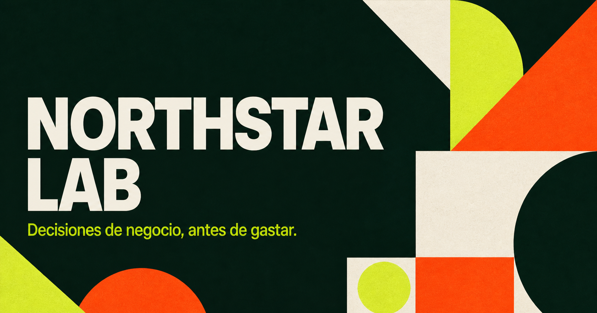

# Northstar Lab



**Decisiones de negocio, antes de gastar.**

### [Abrir la experiencia interactiva →](https://northstar-lab-xavi2321.teal-pine-5167.chatgpt.site)

Northstar Lab es un caso de negocio interactivo que traduce decisiones cotidianas de una pyme —precio, demanda e inversión comercial— en resultados financieros comprensibles. El caso utiliza una cafetería urbana ficticia de Barcelona y datos sintéticos.

## El problema

Facturar más no siempre significa ganar más. Antes de escalar, una pyme necesita entender su margen de contribución, sus costes fijos y cuántas ventas necesita para no perder dinero. Esta aplicación permite probar hipótesis sin arriesgar capital real.

## Qué demuestra

- Modelización de *unit economics* y punto de equilibrio.
- Traducción de una necesidad empresarial a una experiencia digital.
- Desarrollo con React, TypeScript y diseño responsive.
- Comunicación visual de métricas y recomendaciones.
- Pensamiento crítico: el modelo explicita límites y supuestos.

## Modelo

```text
pedidos_mensuales = pedidos_diarios × 26
ingresos = pedidos_mensuales × precio_medio
coste_variable = pedidos_mensuales × 1,08 €
beneficio = ingresos − coste_variable − (8.700 € + marketing)
margen_neto = beneficio / ingresos
punto_equilibrio = costes_fijos / (precio_medio − coste_variable_unitario)
```

Consulta [la metodología completa](docs/MODELO.md) para entender los supuestos, limitaciones y posibles mejoras.

## Ejecutarlo localmente

Requiere Node.js 22.13 o superior.

```bash
npm install
npm run dev
```

Después abre `http://localhost:3000`.

## Próximos pasos

- Incorporar elasticidad precio-demanda a partir de datos reales.
- Añadir flujo de caja, estacionalidad e intervalos de incertidumbre.
- Comparar escenarios y exportar un informe ejecutivo.
- Validar los supuestos con entrevistas a pequeños negocios.

## Nota académica

Los datos son ficticios y el resultado no constituye asesoramiento financiero. El objetivo es demostrar un proceso de análisis, no presentar una predicción.

## Licencia

MIT — puedes estudiar, adaptar y reutilizar el código citando el proyecto.
